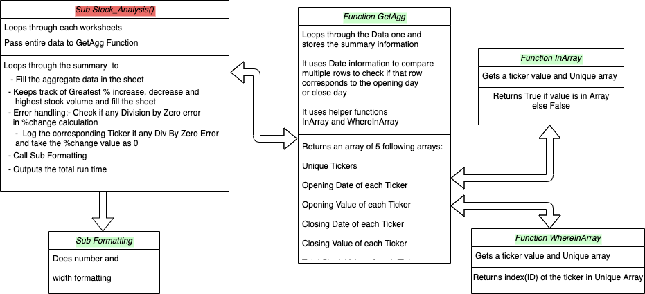
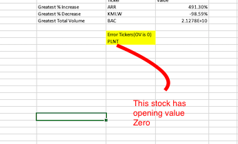
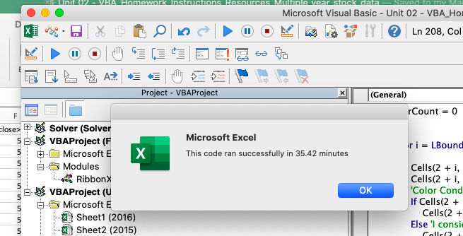
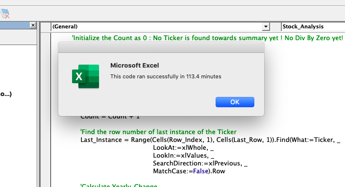
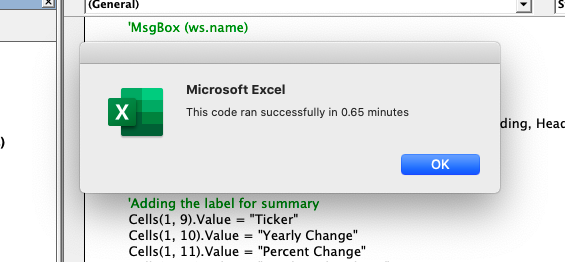

# The VBA of Wall Street
Use of  VBA scripting to analyze real stock market data. 

<div style="text-align:center"></div>

- Create a script that will loop through all the stocks for one year and output the following summary information.

  - The ticker symbol.

  - Yearly change from opening price at the beginning of a given year to the closing price at the end of that year.

  - The percent change from opening price at the beginning of a given year to the closing price at the end of that year.

  - The total stock volume of the stock.

- Do conditional formatting that will highlight positive change in green and negative change in red.

- The olution will also be able to return the stock with the "Greatest % increase", "Greatest % decrease" and "Greatest total volume". The solution will look as follows:


<div style="text-align:center"></div>

- Make the appropriate adjustments to your VBA script that will allow it to run on every worksheet, i.e., every year, just by running the VBA script once.


## Dataset
Dev Data- <a href=Dataset/alphabetical_testing.xlsm>Dev Data (small)</a>
Test Data- <a href=Dataset/VBA_Homework_Instructions_Resources_Multiple_year_stock_data.xlsm>Test Data (huge)</a>


# Solution 1:
VBA code - <a href=wall_streat_challenge_solution1.vbs>wall_streat_challenge_solution1.vbs</a>
- Run the subroutine Stock_Analysis

Screenshots of results:
- <a href=Result_screenshot_2016_Solution1.png>Result_screenshot_2016_Solution1.png</a>
- <a href=Result_screenshot_2015_Solution1.png>Result_screenshot_2015_Solution1.png</a>
- <a href=Result_screenshot_2014_Solution1.png>Result_screenshot_2014_Solution1.png</a>

<div style="text-align:center"></div>


- **This solution does not use any workbook application function**
- **It loops through the entire data once, get the summary and loops through the small summary once to get the toppers and floppers** 
- **This solution works even if the data is not sorted**
- It loops through all the sheets and gives the result
- **One extra feature is added to keep track of division by zero error**
  - If any ticker has Opening Value = 0, Percent Change becomes Infinity and results in Division by Zero Error
  - Under the occurance of division by zero, Percent Change is taken as 0% and corresponding tickers are logged in the sheet  and highlighed
  - **One Ticker (PNTL) has this problem - happens in 2015 and 2014 years**
  <div style="text-align:center"></div>
  
- **Code returns the total run time taken**

  <div style="text-align:center"></div>

**As this solution uses arrays and redimensioning, it takes about 36 minutes to run**


# Solution 2:

VBA code - <a href=wall_streat_challenge_solution2.vbs>wall_streat_challenge_solution2.vbs</a>
- Run the subroutine Stock_Analysis

Screenshots of results:
- <a href=Result_screenshot_2016_Solution2.png>Result_screenshot_2016_Solution2.png</a>
- <a href=Result_screenshot_2015_Solution2.png>Result_screenshot_2015_Solution2.png</a>
- <a href=Result_screenshot_2014_Solution2.png>Result_screenshot_2014_Solution2.png</a>

This solution has only two subroutines; **Stock_Analysis** consists of the main logic and **Formatting** carries out the required formatting. The main logic of Stock_Analysis is as follows:

## Algorithm

```
Note the Start Time

Loop through each worksheet(2016, 2015, 2014):

      Activate the current worksheet
      Sort the entire sheet using inbuilt function Sort
      Find the Last Row
  
      #Initialize
          The variables Count (total number of unique tickers) As 0, Error Count (Any Div by Zero?) As 0
          Row Index As 2 (skip the header row)
          Topper Flopper Names - Array Initialized: Pos0 - Ticker with Greatest% Increase, Pos1 - Ticker with Greatest%   Decrease, Pos2 - Ticker with Greatest Stock Volume
          Topper Flopper Values - Array Initialized: Pos0 - Greatest% Increase, Pos1 - Greatest% Decrease, Pos2 - Greatest Stock Volume
  
      While Row Index <= Last Row:
          Find the row corresponds to the **Last Instance** of that Ticker using inbuilt function **Find**
          Calculate the Yearly Change
          Increment the Error Count if any Div by Zero Error (Mark the corresponding Ticker in the sheet)
          Calculate the Percentage Change 
          Calculate the Total Stock Volume using inbuilt function Sum
          Update the summary row in the sheet
        
          #Keep track of the Toppers and Floppers as below
          If Count = 0
              Topper Flopper Names <- Names of the  first Ticker as a base for further comparison
              Topper Flopper Values <- Values of the  first Ticker as a base for further comparison
          Else:
              Update Topper Flopper Names and Topper Flopper Values
              If Current Perc Change > Topper Flopper Values[Pos0]:
                Topper Flopper Values[Pos0] <- Current Perc Change
                Topper Flopper Names[Pos0] <- Current Ticker
              If Current Perc Change < Topper Flopper Values[Pos1]:
                Topper Flopper Values[Pos1] <- Current Perc Change
                Topper Flopper Names[Pos1] <- Current Ticker
              If Current Total Stock Volume > Topper Flopper Values[Pos2]:
                Topper Flopper Values[Pos2] <- Current Total Stock Volume
                Topper Flopper Names[Pos2] <- Current Ticker
          End If
            
          Update the Row Index as Last Instance + 1
      End of while Loop
      
      Update the sheet with Topper Flopper Names and Values
      Call Formatting Subroutine for Formatting
      
End of the current worsksheet

Note the total time elapsed and notify in a messagebox
```
This solution also includes the features incorporated in Solution 1
  - Track and highlight tickers with opening value zero
  - Outputs the total run time
 As it includes the inbuilt find function to find the last index, it takes a lot of time (about 114 minutes) to run.
 <div style="text-align:center"></div>
            
    
# Solution 3:

VBA code - <a href=wall_streat_challenge_solution3.vbs>wall_streat_challenge_solution3.vbs</a>
- Run the subroutine Stock_Analysis

Screenshots of results:
- <a href=Result_screenshot_2016_Solution3.png>Result_screenshot_2016_Solution3.png</a>
- <a href=Result_screenshot_2015_Solution3.png>Result_screenshot_2015_Solution3.png</a>
- <a href=Result_screenshot_2014_Solution3.png>Result_screenshot_2014_Solution3.png</a>

Just like Solution2, this solution also has only two subroutines; **Stock_Analysis** consists of the main logic and **Formatting** carries out the required formatting. The main logic of Stock_Analysis is as follows:

## Algorithm

```
Note the Start Time

Loop through each worksheet(2016, 2015, 2014):

      Activate the current worksheet
      Sort the entire sheet using inbuilt function Sort
      Find the Last Row
  
      #Initialize
          The variables Count (total number of unique tickers) As 0, Error Count (Any Div by Zero?) As 0, Total Stock Volume As 0
          First Instance As 2 (Row Corresponds to the First Ticker)
          Topper Flopper Names - Array Initialized: Pos0 - Ticker with Greatest% Increase, Pos1 - Ticker with Greatest%   Decrease, Pos2 - Ticker with Greatest Stock Volume
          Topper Flopper Values - Array Initialized: Pos0 - Greatest% Increase, Pos1 - Greatest% Decrease, Pos2 - Greatest Stock Volume
  
      For Row Index = 2 To  Last Row:
          If current row ticker name  NOT EQUAL TO  next row ticker name
              Calculate the Yearly Change <- Close Value at current row - Open Value at First Instance
              Increment the Error Count if any Div by Zero Error (Mark the corresponding Ticker in the sheet)
              Calculate the Percentage Change <- Yearly Change / Open Value at First Instance
              Total Stock Volume <- Total Stock Volume + Stock Volume at the current row
              Update the summary row in the sheet
              
              Update the First Instance <- Row Index + 1
              Reset the Total Stock Volume <- 0
              
              Increment the Count (+1)
              #Keep track of the Toppers and Floppers as below
              If Count = 1
                  Topper Flopper Names <- Names of the  first Ticker as a base for further comparison
                  Topper Flopper Values <- Values of the  first Ticker as a base for further comparison
              Else:
                  Update Topper Flopper Names and Topper Flopper Values
                  If Current Perc Change > Topper Flopper Values[Pos0]:
                    Topper Flopper Values[Pos0] <- Current Perc Change
                    Topper Flopper Names[Pos0] <- Current Ticker
                  If Current Perc Change < Topper Flopper Values[Pos1]:
                    Topper Flopper Values[Pos1] <- Current Perc Change
                    Topper Flopper Names[Pos1] <- Current Ticker
                  If Current Total Stock Volume > Topper Flopper Values[Pos2]:
                    Topper Flopper Values[Pos2] <- Current Total Stock Volume
                    Topper Flopper Names[Pos2] <- Current Ticker
              End If
              
          Else
              Total Stock Volume <- Total Stock Volume + Stock Volume at the current row
          EndIf
      Next Row Index
          
     
      Update the sheet with Topper Flopper Names and Values
      Call Formatting Subroutine for Formatting
      
End of the current worsksheet

Note the total time elapsed and notify in a messagebox
```
This solution also includes the features incorporated in Solution 1 and 2
  - Track and highlight tickers with opening value zero
  - Outputs the total run time

**This runs super fast (0.65 minutes)!!!, as no inbuilt functions like find in solution2 (other than sort function) and array redimensioning (as used in Solution1)**
 
 <div style="text-align:center"></div>

**Please note that the time taken for Solution 2 and 3 will vary based on how shuffled the dataset gets. Both the solutions use inbuilt sort function**


